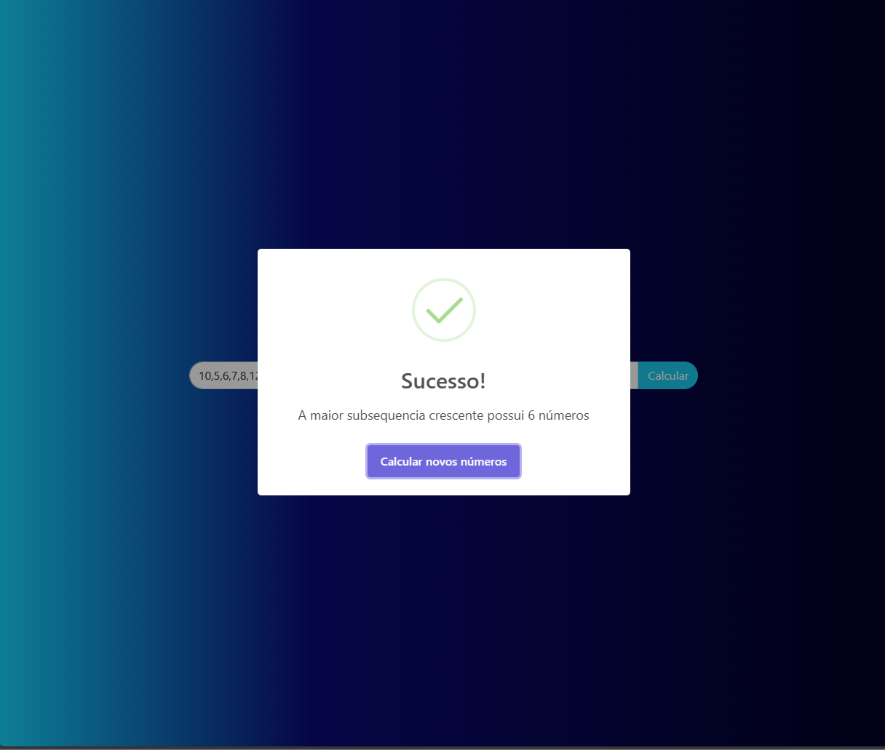
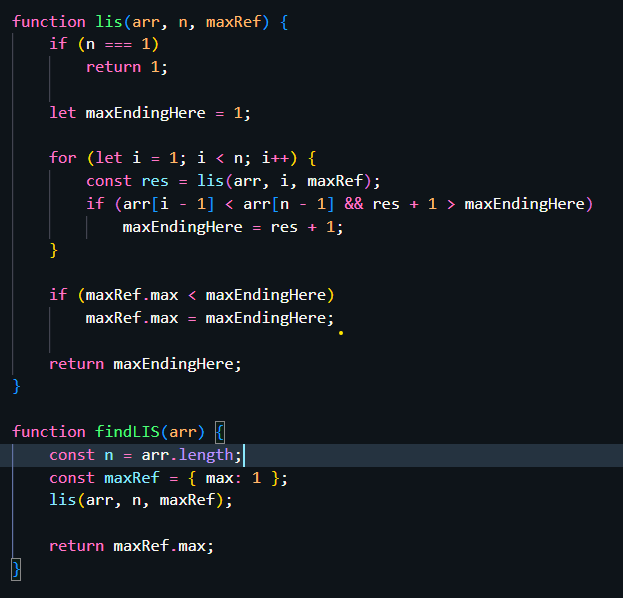

# NomedoProjeto

**Número da Lista**: 1<br>
**Conteúdo da Disciplina**: Programação Dinâmica<br>

## Alunos
|Matrícula | Aluno |
| -- | -- |
| 17/0140571  |  Douglas Farias de Castro |
| 17/0034941  |  Guilherme Peixoto |

## Sobre 
Foram realizados 2 projetos um com o algorítimo de sequence aligment e o segundo de maior subsequencia crescente. 
## Screenshots
Adicione 3 ou mais screenshots do projeto em funcionamento.
### Projeto 1:

### Projeto 2:
### **Site maior sequencia crescente**

### **Código motor**


## Instalação 
### Projeto 1
**Linguagem**: Python<br>
**Framework**: Poetry, FastAPI, Uvicorn<br>

1. Para executar o projeto localmente, primeiro você deve ter o [Python 3](https://www.python.org/downloads/) e o gerenciador de dependências [Poetry](https://python-poetry.org/docs/#installation) devidamente instalados na sua máquina.
   
2. Entre no shell do Poetry e instale as dependências:
   
  ```bash
    poetry shell
  ```

3. Instale as dependências:
   
  ```bash
    poetry install
  ```

4. Inicie o servidor Uvicorn:

  ```bash
    uvicorn app:app --reload   
  ```

  Agora só acessar: [http://127.0.0.1:8000](http://127.0.0.1:8000).

  
### Projeto 2
Para executar o projeto basta baixar e abrir o arquivo html no navegador


## Uso 
Explique como usar seu projeto caso haja algum passo a passo após o comando de execução.

## Outros 
Quaisquer outras informações sobre seu projeto podem ser descritas abaixo.


